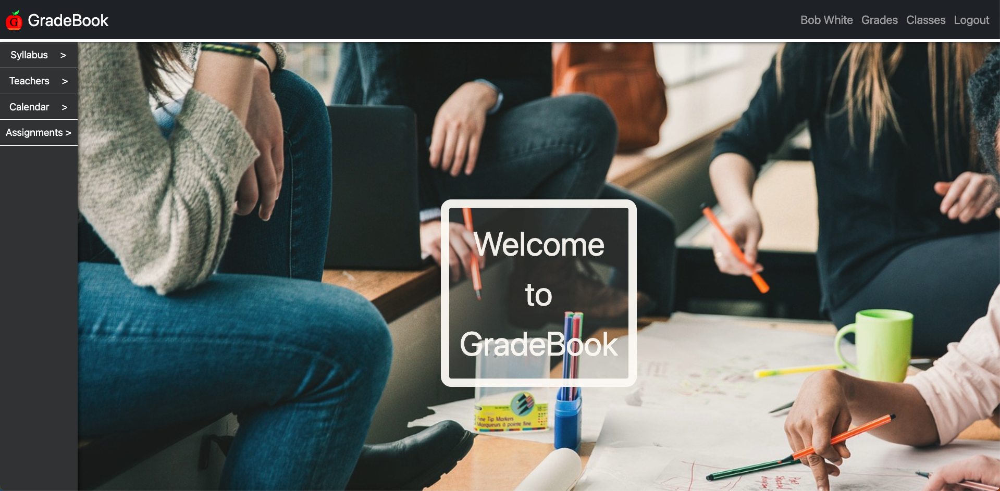
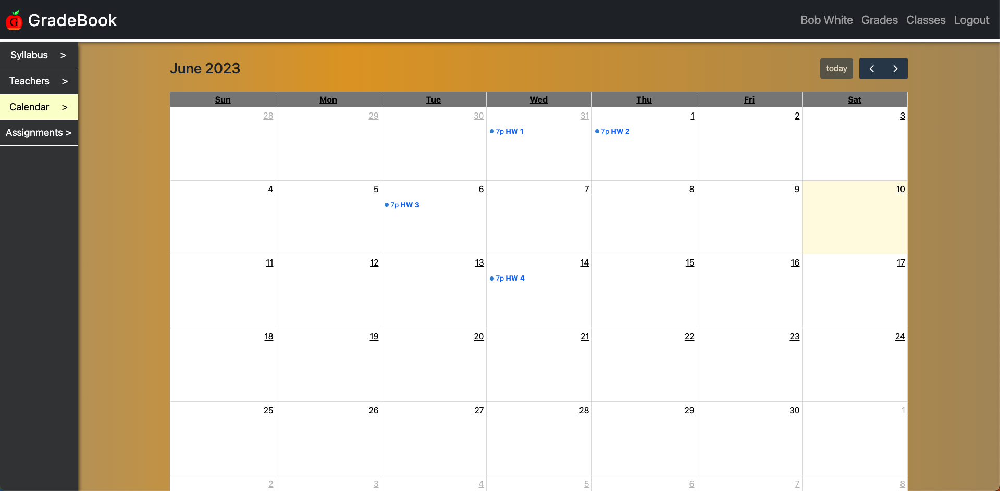

# Gradebook

## Description

This application exhibits a student's grades in a simple and organized manner. The overall goal of the application is to organize grade information in a way that makes sense and can be quickly viewed by users. Grades can be seen by a user that is a teacher or a student. New users must sign up to access most of the application and returning users can log in. The server-side code is heavily dependent on Express, MongoDB, and Mongoose while the client-side mainly uses React. There are four models used in the creation of this application: User, Grade, Class, and Assignment.

There are two navigational bars on the website. One is on the left side, and the other is on the top. The bar on the left enables users to view syllabi, teachers, the calendar, and assignments. The navbar on the top has anchors that can take the user to their profile, grade page, or classes page, and there is a logout anchor.

The calendar feature shows assignments on a monthly basis. The calendar utilizes a JavaScript library called FullCalendar, which works well with React.

## Tests

Testing this program can be done in a local environment by entering the `npm run develop` command in a terminal. Make sure the terminal is open at the root level.

## Tech Stack

JavaScript, CSS, HTML, Node.js, Express, React, React-Bootstrap, MongoDB, Mongoose, jsonwebtoken, cookie-parser, concurrently, Bcrypt, dotenv, FullCalendar, Material UI

## Screenshots

## Link to the Deployed Application

https://umb-gradebook.herokuapp.com/

## Creators

Sean Hayes, Joshua Martinez, Belane Belayhun, and Noah Dockman

## GitHub Profiles

[hayessea000](https://github.com/hayessea000)

[JoshuaMartinez1014](https://github.com/JoshuaMartinez1014)

[belaneb](https://github.com/belaneb)

[NDockman](https://github.com/NDockman)

## Outside Sources

- StackOverflow
- Gary Almes
